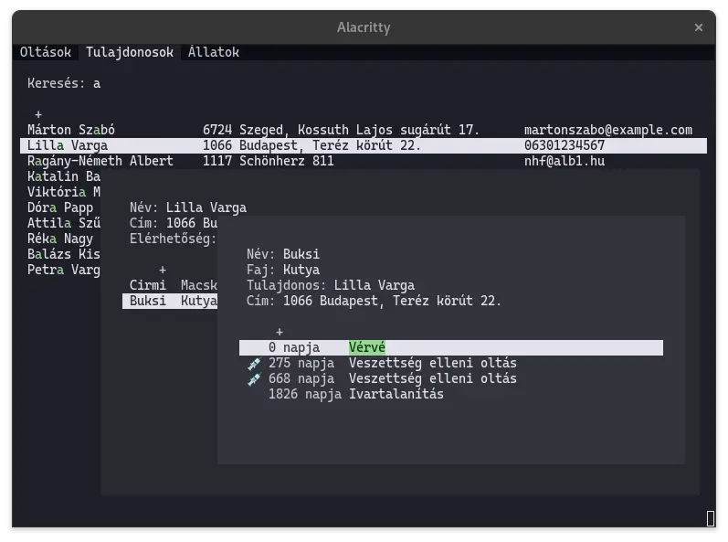

# Vetman2



Parancssori C++ alkalmazás, ami egy állatorvosi rendelő életét segíti.
Kezeli a tulajdonosok, állataik és azok kezeléseik adatait.
Képes kiszámítani az esedékes oltásokat, a tulajdonosokat és az állatokat pedig név szerint lehet keresni.  
Forráskód: https://github.com/albi005/prog2/tree/main/nhf#readme  
C verzió: https://github.com/albi005/prog1/tree/main/nhf#readme

## Futtatás

```bash
git clone https://github.com/albi005/prog2
cd prog2/nhf
g++ *.cpp
./a.out
```

A megjelenítés Windows-on nem biztosan működik, erről részletesebben a `console.c` leírásánál.

## Használat

Futtatás után a főmenübe kerülünk, ahol a `TAB` billentyűvel lehet az aloldalak között váltani.

Az első aloldal kilistázza a tulajdonosokat, az alapján rendezve, hogy a legrégebben oltott állatjuk mikor volt oltva veszettség ellen.
A listában a fel/le nyilakkal lehet mozogni, majd `ENTER`-rel lehet egy adott tulajdonos adatait megnyitni.

A második aloldalon tulajdonosokat lehet keresni, név alapján.
`ENTER` megnyomása után, ahogy elkezdünk gépelni, a lista frissül. A keresést újabb `ENTER`-rel lehet befejezni, vagy `ESC`-pel törölni.
Itt is ugyanúgy a fel/le nyilakkal lehet váltani és az `ENTER`-rel megnyitni az adott tulajdonos adatait.
A lista első eleme mindig egy "új tulajdonos hozzáadása" gomb, ami kiválasztásával egy új adatlap nyílik meg, a megadott névvel.

A harmadik aloldalon a másodikhoz hasonlóan állatok nevével lehet keresni. Listaelem kiválasztása és `ENTER` után az állat adatlapja nyílik meg.

#### Tulajdonos adatlap
Az oldal először a tulajdonos adatait listázza ki, ezek között a nyilakkal lehet mozogni, és `ENTER`-rel lehet módosítani azokat. Módosítást újabb `ENTER`-rel lehet menteni, `ESC`-pel, pedig visszavonni.
Itt ha megnyomjuk a `SHIFT+D` billentyűket, a tulajdonos és állatai törlődnek.

Az adatok után a tulajdonos állatainak listája van. Egy állat kijelölése után annak az adatlapja nyílik meg. Ebben a listában is a legelső elem az "új állat hozzáadása".

#### Állat adatlap
A tulajdonos adatlaphoz hasonlóan először az állat adatai szerepelnek, majd a korábbi vizsgálatok/kezelések listája.
Állatot törölni egy tulajdonság kiválasztása közben `SHIFT+D`-vel lehet.

A kezelések szerkeszthetőek és itt is a legelső lehetőség új felvétele.
A kezeléseknél `SPACE`-szel kiválasztható, hogy aznap kapott-e veszettség elleni oltást, emellett a kezeléssel kapcsolatos összes egyéb információ `ENTER` megnyomásával adható meg.
Kezelést törölni `SHIFT+D`-vel lehet.

<!-- ## Kód -->
<!-- A legtöbb `.c` fájlhoz tartozik egy `.h` fájl is, a függvények dokumentációja itt található. -->
<!---->
<!-- ### Függőségek -->
<!-- A konzolos kiíráshoz az `econio` könyvtár van mellékelve, ezen kívül csak a szabványos könyvtár van használva. -->
<!---->
<!-- ### `main.c` -->
<!-- A program belépési pontja. A `main` függvény betölti az adatokat, majd egy végtelen ciklusban rajzol a képernyőre, vár inputra, majd kezeli azt. -->
<!-- Kilépésnél elmenti, majd felszabadítja az adatokat. -->
<!---->
<!-- ### Fájl- és adatkezelés: `owner.c`, `animal.c` és `treatment.c` -->
<!-- Az `owner`, `animal` és `treatment` fájlokbeli adatok kezelésére szolgáló kódot tartalmazzák. Emellett a dinamikus tömb kezelő függvények is itt vannak. -->
<!---->
<!-- Az `open_*` függvény megnyitja a fájlt és a megfelelő adatstruktúrában eltárolja az adatokat. -->
<!-- Állatoknál megkapja a tulajdonosok listáját, a kezeléseknél pedig az állatokat is. Itt azonosító alapján bináris kereséssel megkeresi az állat gazdáját, kezelésnél pedig a hozzá tartozó állatot. -->
<!---->
<!-- A `close_*` függvény elmenti az adatokat és felszabadítja a hozzájuk tartozó memóriát. -->
<!---->
<!-- ### `console.h` -->
<!-- [ANSI escape sequence](https://en.wikipedia.org/wiki/ANSI_escape_code)-ek kiírását és egyéb konzolos feladatokat megvalósító függvények. Ezek gyenge Windows-os támogatottsága miatt főleg csak Linux-on működik az alkalmazás. -->
<!-- Az UTF-8 code point kezelő függvények is itt vannak. -->
<!---->
<!-- ### `states.h` -->
<!-- Az alkalmazás állapotát tároló struktúrák és felsorolások.  -->
<!---->
<!-- ### `input.c` -->
<!-- A `handle_input(char input, App* app)`  függvény megkapja a legutoljára lenyomott billentyűt és az alapján módosítja az alkalmazás állapotát. -->
<!---->
<!-- ### `draw.h` -->
<!-- A `draw(App* app)` függvény az alkalmazás állapota alapján rajzol a terminálra. -->
