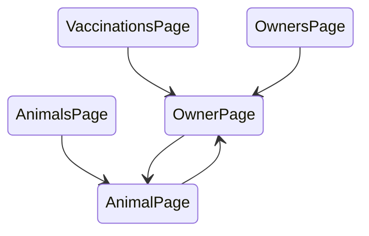
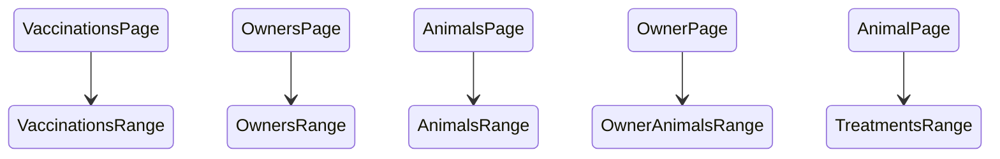

# Prog2 NHF

> Ragány-Németh Albert (GL6IFB)

## Specifikáció

Ez egy parancssori alkalmazás, ami egy állatorvosi rendelő életét segíti. Eltárolja a tulajdonosok és állataik adatait.

Futtatás után a főmenübe kerülünk, ahol a `TAB` billentyűvel lehet az aloldalak között váltani.

Az első aloldal (`VaccinationsPage`) kilistázza a tulajdonosokat, az alapján rendezve, hogy a legrégebben oltott állatjuk mikor volt oltva veszettség ellen.
A listában a fel/le nyilakkal lehet mozogni, majd `ENTER`-rel lehet egy adott tulajdonos adatait megnyitni.

A második aloldalon (`OwnersPage`) tulajdonosokat lehet keresni, név alapján.
`ENTER` megnyomása után, ahogy elkezdünk gépelni, a lista frissül. A keresést újabb `ENTER`-rel lehet befejezni, vagy `ESC`-pel törölni.
Itt is ugyanúgy a fel/le nyilakkal lehet váltani és az `ENTER`-rel megnyitni az adott tulajdonos adatait.
A lista első eleme mindig egy "új tulajdonos hozzáadása" gomb, ami kiválasztásával egy új adatlap nyílik meg, a megadott névvel.

A harmadik aloldalon (`AnimalsPage`), a másodikhoz hasonlóan, állatok nevével lehet keresni. Listaelem kiválasztása és `ENTER` után az állat adatlapja nyílik meg.

### Tulajdonos adatlap (`OwnerPage`)

Az oldal először a tulajdonos adatait listázza ki, ezek között a nyilakkal lehet mozogni, és `ENTER`-rel lehet módosítani azokat. Módosítást újabb `ENTER`-rel lehet menteni, `ESC`-pel, pedig visszavonni.
Itt ha megnyomjuk a `SHIFT+D` billentyűket, a tulajdonos és állatai törlődnek.

Az adatok után a tulajdonos állatainak listája van. Egy állat kijelölése után annak az adatlapja nyílik meg. Ebben a listában is a legelső elem az "új állat hozzáadása".

### Állat adatlap (`AnimalPage`)

A tulajdonos adatlaphoz hasonlóan először az állat adatai szerepelnek, majd a korábbi vizsgálatok/kezelések listája.
Állatot törölni egy tulajdonság kiválasztása közben `SHIFT+D`-vel lehet.

A kezelések szerkeszthetőek és itt is a legelső lehetőség új felvétele.
A kezeléseknél `SPACE`-szel kiválasztható, hogy aznap kapott-e veszettség elleni oltást, emellett a kezeléssel kapcsolatos összes egyéb információ `ENTER` megnyomásával adható meg.
Kezelést törölni `SHIFT+D`-vel lehet.

### Adatok tárolása
A program futtatáskor beolvassa az adatokat, és kilépéskor pedig kiírja azokat a következő fájlokba:

```
owners
	id
	név
	lakcím
	elérhetőség
animals
	id
	owner_id
	név
	fajta
treatment
	id
	animal_id
	időpont (unix timestamp)
	kapott veszettség oltást? (1, ha igen)
	egyéb leírás
```

A különböző tulajdonságok új sorokba kerülnek, és egy adott objektum utolsó tulajdonsága után a következő első tulajdonsága következik.

## Terv

### Perzisztencia

Az adatok betöltését és tárolását repository osztályok végzik:


Az üzleti logika nagy részét a generikus `Repository<TEntity>` tartalmazza, az entitás specifikus osztályok csak az objektum relációk beállításáért felelnek.

### Megjelenítés
A megjelenítést és input kezelést `View` osztályok végzik:


A `handleInput` metódus megkapja a leütött billentyű kódját és az alapján módosítja az állapotát. Minden `View` először az éppen aktív gyerekének hívja meg a `handleInput` metódusát. Ha az adott `View` nem kezeli az inputot, a függvény hamis értéket ad vissza és a szülő kezelheti az inputot.

A `draw` metódus egy `ICanvas` objektummal tud rajzolni.


Az `OstreamCanvas` egy `std::ostream` objektumra
rajzol [ANSI escape code](https://en.wikipedia.org/wiki/ANSI_escape_code)-okkal.
A `PaddedCanvas` egy másik `ICanvas`-ra rajzol [padding](https://developer.mozilla.org/en-US/docs/Web/CSS/padding)
hozzáadásával.

A három kezdőoldal (`VaccinationsPage`,`OwnersPage` és `AnimalsPage`) egy `Tabs` osztályban van, ez biztosítja az aloldalak közötti váltogatást.

A legfelső `View` egy `PageStack` objektum, ez [hierachikus navigációt](https://learn.microsoft.com/en-us/dotnet/maui/user-interface/pages/navigationpage) valósít meg.
Tulajdonos vagy állat kiválasztásakor megjelenik a hozzátartozó `OwnerPage` vagy `AnimalPage`:



Mivel az alkalmazás minden oldala egy listából áll, a `ListView` osztály lett bevezetve:


Ez a `View` osztlályhoz hasonló `ListRange` implementációkat tartalmaz és azokat rajzolja ki:


Minden oldal a konstruktorában állítja be, hogy milyen `ListRange`-eket tartalmaz. Például az `OwnersPage` egy keresőmezőt, egy üres sort, egy hozzáadás gombot és a tulajdonosok listáját
(`OwnersRange`) tartalmazza.
Minden oldalhoz tartozik egy külön `ListRange` ami az adott oldalnak megfelelően rajzolja ki az elemeket:


Ezek után a `main` függvény valahogy így fog kinézni:

```cpp
// Adatok betöltése fájlokból
Data data = Data("owners", "animals", "treatments");

auto* pageStack = new PageStack();
pageStack->push(new Tabs(
    new VaccinationsPage(data, *pageStack),
    new OwnersPage(data, *pageStack),
    new AnimalsPage(data, *pageStack),
    *pageStack
));

App app(pageStack);

OstreamCanvas canvas(std::cout);

while (true) {
    app.draw(canvas);
    canvas.updateScreenSize(std::cin);
    int input = econio_getch();
    bool handled = app.handleInput(input);
    if (!handled && input == KEY_ESCAPE)
        break;
}
```
